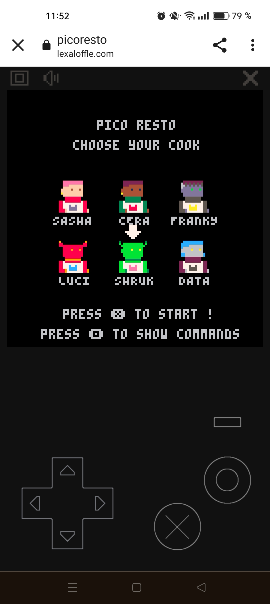
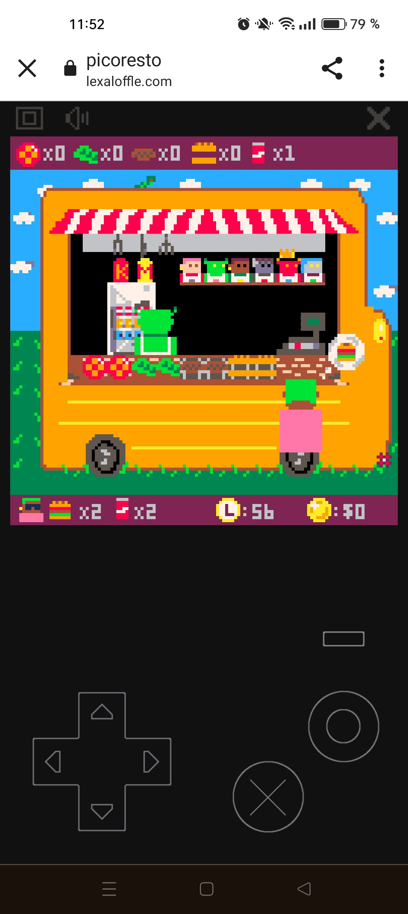
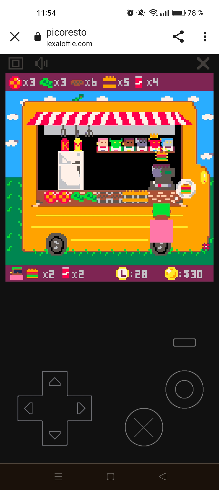

# projet-collectif---pico-8-pico-resto

Création d'un jeu vidéo rétro

## Contraintes : 
- Durée : 2 semaines
- Moteur : [Pico-8](https://www.lexaloffle.com/pico-8.php)
- Langage : Lua

## Notions abordées : 

- Moteur de jeu
- Infographie 2D
- Gestion d'équipe : le projet a été majoritairement créé en mob-programming.

## Description : 

Nous avons décidé de nous inspirer du jeu vidéo Overcooked!.
Il s'agit d'un chef cuisinier travaillant dans un food truck. 
Des clients apparaissent avec un design aléatoire parmi 3 et une commande allant d'un à quatre burgers et d'une à quatre canettes. 
Le chef cuisinier travaille ses ingrédients : tomates, salades, steaks et pains, il récupère également les canettes dans le réfrigérateur. 
Une fois que l'ensemble des ingrédients nécessaires à la réalisation de la commande client sont réunis, alors le chef cuisinier peut vendre la commande en validant l'assemblage à la caisse.

      
